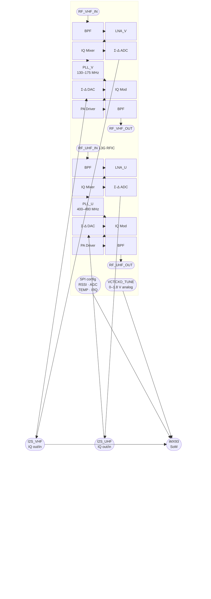
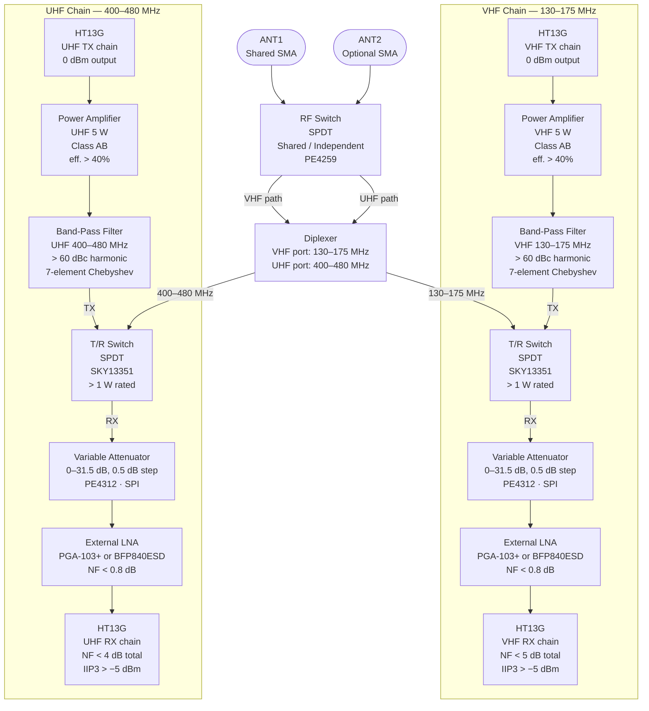
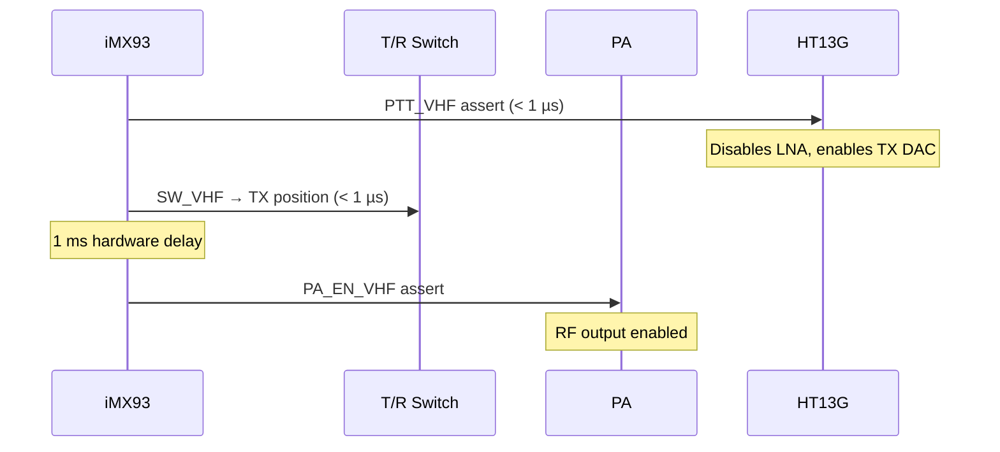
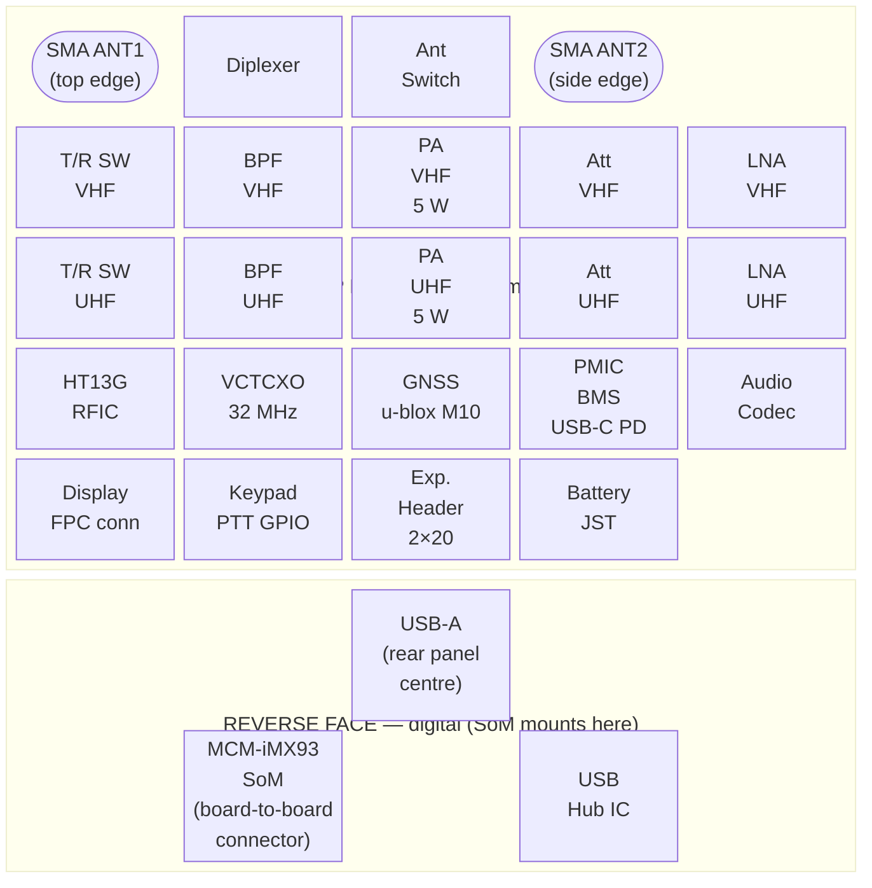
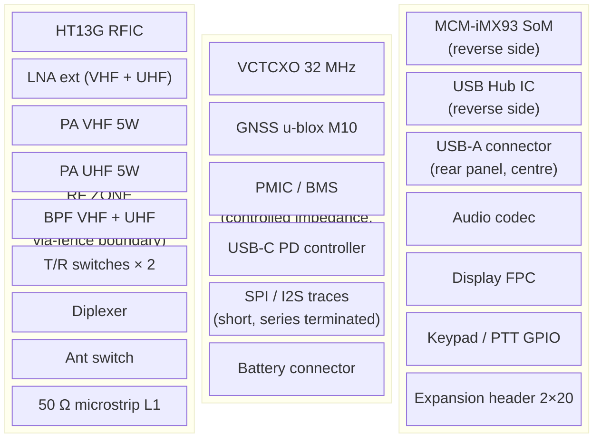
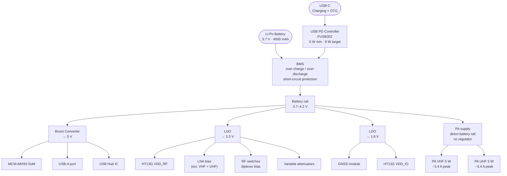
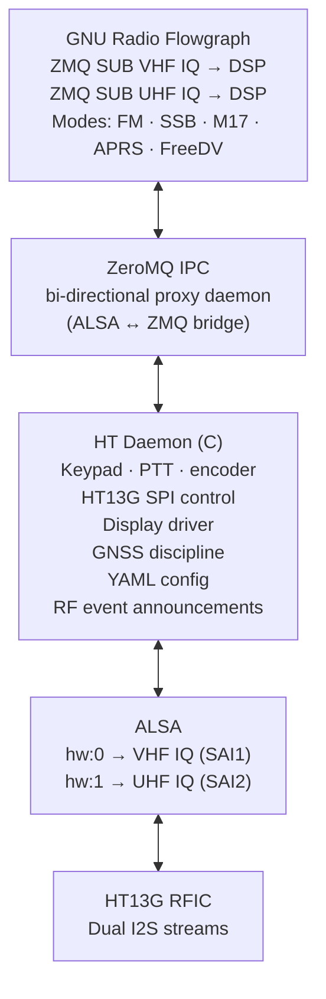
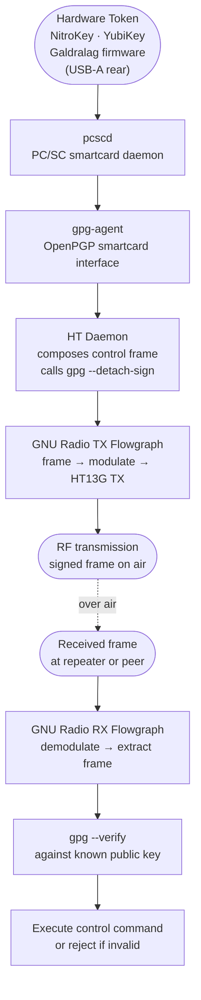

# Dual-Band Open SDR Handheld — System Design Specification
**Codename: OpenHT-DB (Open Handheld Transceiver, Dual-Band)**
*Draft v0.3*

---

## 1. Project Philosophy

No existing commodity RFIC adequately covers both 144 MHz and 430 MHz with sufficient IQ bandwidth, low noise, and a clean open digital interface suitable for an embedded Linux SDR platform. The solution is a purpose-designed RFIC, a system board architected from the ground up, and a custom splash-proof chassis — not constrained by any donor radio enclosure.

---

## 2. Why a Custom RFIC

### 2.1 Commodity Chip Gap Analysis

| Chip | VHF 144 MHz | UHF 430 MHz | IQ BW | Disqualifier |
|---|:---:|:---:|---|---|
| SX1255 | ✗ | ✓ | 500 kHz | 400 MHz lower limit; no VHF |
| CC1200 | ✓ | ✓ | ~200 kHz | Bandwidth too narrow for SSB / wideband digital |
| AT86RF215 | ✗ | ✓ | 4 MHz | 400 MHz lower limit; no VHF |
| AD9361 | ✓ | ✓ | 56 MHz | Power and size prohibitive for handheld |
| Si4463/Si4468 | ✓ | ✓ | ~1 MHz | Obsolete architecture; no clean IQ stream |
| RFFC5072 | ✓ | ✓ | wide | Mixer-only; requires external LNA/VCO/ADC |

No commodity part covers 130–480 MHz with ≥500 kHz IQ bandwidth, sub-5 dB noise figure, full-duplex per band, and an I2S digital baseband interface compatible with Linux ALSA. A custom RFIC is the only clean path.

### 2.2 Fabrication Process: IHP SG13G2 130 nm SiGe BiCMOS

IHP Microelectronics (Frankfurt Oder, Germany) offers an open-source PDK for their SG13G2 process:

- SiGe:C npn-HBT: fT up to 300 GHz, fmax up to 500 GHz — entirely adequate for sub-500 MHz RFIC
- Open-source PDK under Apache 2.0; toolchain: KLayout, Xschem, OpenEMS, ngspice
- Active OpenMPW shuttle program: ~2 mm² community slots per submission
- Multiple academic RF designs validated on this process (IEEE Xplore: search "IHP SG13G2 LNA")
- Commercial prototyping available at IHP for post-MPW production runs
- Fallback: design portable to GlobalFoundries 8XP (commercial 130 nm SiGe) if needed

---

## 3. HT13G Custom RFIC Specification

**HT13G — Handheld Transceiver, 130 nm SiGe**

### 3.1 Internal Architecture

Both chains are fully independent — no shared LO, no shared VCO. Inter-band isolation > 60 dB.

### 3.2 Receive Path Specifications

| Parameter | VHF Chain | UHF Chain | Notes |
|---|---|---|---|
| Frequency range | 130–175 MHz | 400–480 MHz | Covers 2m and 70cm globally |
| Architecture | Zero-IF direct conversion IQ | same | |
| LNA topology | Common-emitter SiGe HBT, inductively degenerated | same | |
| Noise figure | < 5 dB | < 4 dB | At matched 50 Ω, 25°C |
| Input impedance | 50 Ω | 50 Ω | External matching network |
| IIP3 | > −5 dBm | > −5 dBm | |
| LNA gain | 12–20 dB, 4 programmable steps | same | |
| Image rejection | > 40 dBc | > 40 dBc | Direct-conversion; DC offset correction required |
| ADC architecture | 1-bit Σ-Δ, 38.4 MHz oversampled, decimated | same | Matches SX1255 approach |
| ADC output word | 16-bit I + 16-bit Q signed | same | |
| Sample rates | 25 / 50 / 100 / 200 / 500 kHz | same | |
| Max IQ bandwidth | 500 kHz | 500 kHz | |
| DC offset cancellation | Digital feedback loop, programmable time constant | same | |
| IQ imbalance | < 1 dB amplitude, < 2° phase post-calibration | same | |
| RSSI | 8-bit, ±2 dB, SPI-readable | same | |
| AGC | Programmable threshold + step; manual SPI override | same | |

### 3.3 Transmit Path Specifications

| Parameter | VHF Chain | UHF Chain | Notes |
|---|---|---|---|
| Architecture | Direct IQ upconversion | same | |
| DAC architecture | 1-bit Σ-Δ interpolating | same | |
| Input sample rates | 25 / 50 / 100 / 200 / 500 kHz | same | |
| Output power (chip) | 0 ± 2 dBm into 50 Ω | same | External 5 W PA required |
| Harmonic suppression | > 25 dBc | > 25 dBc | PCB band filter brings this to > 60 dBc |
| TX/RX isolation | > 40 dB | > 40 dB | On-chip switch + external T/R switch |
| PA driver current | Programmable 0 / 50 / 100% | same | Low-power beacon mode without external PA |

### 3.4 PLL / Frequency Synthesis

| Parameter | VHF PLL | UHF PLL |
|---|---|---|
| Architecture | Integer-N + fractional Σ-Δ extension | same |
| VCO range | 130–175 MHz direct | 400–480 MHz direct |
| Reference | 32 MHz shared VCTCXO | same |
| VCTCXO tune | 0–1.8 V analog input, ±50 ppm pull | — |
| Phase noise @ 10 kHz offset | < −90 dBc/Hz | < −95 dBc/Hz |
| Lock time | < 1 ms | < 1 ms |
| Frequency resolution | < 100 Hz | < 100 Hz |
| Frequency word | 32-bit via SPI | same |
| Inter-band isolation | > 60 dB — fully independent PLLs | |

### 3.5 Digital Interface

| Signal | Description |
|---|---|
| I2S_VHF: BCLK / LRCLK / DOUT / DIN | VHF IQ stream; I = Left, Q = Right; 16-bit frames |
| I2S_UHF: BCLK / LRCLK / DOUT / DIN | UHF IQ stream; identical format |
| SPI: CLK / MOSI / MISO / CS | Shared config bus; up to 10 MHz |
| PTT_VHF / PTT_UHF | Active-high TX enable per band; hardware path < 1 µs |
| IRQ | Active-low: PLL unlock, AGC threshold, RSSI update |
| RESET_N | Active-low chip reset |
| VCTCXO_TUNE | Analog in 0–1.8 V; disciplines shared 32 MHz reference |

### 3.6 Power

| Rail | Voltage | RX current | TX current |
|---|---|---|---|
| VDD_RF | 3.3 V | 55 mA (both chains) | 80 mA |
| VDD_CORE | 1.2 V (internal LDO) | 20 mA | 25 mA |
| VDD_IO | 1.8 V or 3.3 V selectable | 5 mA | 5 mA |
| **Total** | | **~265 mW** | **~363 mW** |

### 3.7 Package

- QFN-48, 6×6 mm, 0.5 mm pitch
- Exposed thermal/RF ground pad (EPAD); minimum 9-via array to L2
- WLCSP variant possible if die area permits

---

## 4. RF Signal Path Architecture

### 4.1 Full RF Chain — VHF and UHF

### 4.2 PA and Band Filter Detail

#### Power Amplifier — 5 W per band

| Parameter | VHF PA | UHF PA |
|---|---|---|
| Target output | 5 W (37 dBm) | 5 W (37 dBm) |
| Input power | 0 dBm from HT13G | same |
| Required gain | ~37 dB (driver + final stage) | same |
| Architecture | Two-stage: driver + GaAs or LDMOS final | same |
| Supply | Direct battery rail 3.7–4.2 V | same |
| Efficiency | > 40% class AB | same |
| PA enable | GPIO from iMX93, hardware-sequenced after T/R switch | same |
| Candidate ICs | VHF: RA07H1317M or MRFE6VP5600H | UHF: RA07H4047M or AFT09MS031N |

At 5 W output with 40% efficiency, each PA draws ~3.4 A from the battery rail. The PA supply must be decoupled with 220 µF + 100 µF + 100 nF immediately at the PA supply pin. The direct battery connection (no LDO) is mandatory — a linear regulator at this current would dissipate > 1.5 W as heat.

#### Band-Pass / Harmonic Filter

Each TX path has a 7-element Chebyshev band-pass filter between the PA and the T/R switch:

| Parameter | VHF filter | UHF filter |
|---|---|---|
| Passband | 130–175 MHz | 400–480 MHz |
| Insertion loss | < 0.8 dB | < 0.8 dB |
| Harmonic rejection (2nd) | > 60 dBc | > 60 dBc |
| Harmonic rejection (3rd+) | > 70 dBc | > 70 dBc |
| Implementation | SMD inductors + capacitors (0402), tuned at assembly | same |
| PCB footprint | ~25 × 8 mm | ~20 × 8 mm |

The filter is placed between PA output and T/R switch — after the PA, before the antenna. It carries full TX power; component ratings must reflect this (inductor current rating > 1 A, capacitor voltage rating > 30 V).

#### T/R Switch

One SPDT RF switch per band (e.g., SKY13351-378LF or equivalent):

| Parameter | Value |
|---|---|
| Frequency | DC–3 GHz rated; linear at VHF/UHF |
| Insertion loss | < 0.5 dB |
| Isolation TX→RX | > 30 dB |
| Power handling | > 1 W continuous (5 W peak with good thermal path) |
| Switching time | < 1 µs |
| Control | 2 GPIO from iMX93, sequenced before PA enable |

**PTT sequencing (hardware-enforced order):**

On TX→RX transition, PA is de-asserted first, then T/R switch returns to RX, then HT13G PTT released. This prevents the LNA from ever seeing full PA power.

#### Variable Attenuator

One digitally-controlled attenuator per band on the RX path (e.g., PE4312):

| Parameter | Value |
|---|---|
| Range | 0–31.5 dB, 0.5 dB steps |
| Frequency | DC–4 GHz |
| Insertion loss at 0 dB | < 1 dB |
| Control | 6-bit parallel or SPI; latched by GPIO from iMX93 |
| Purpose | Prevents RFIC saturation on strong local signals; software-controlled AGC extension |

#### Diplexer

LC diplexer, crossover at ~250 MHz:

| Parameter | VHF port | UHF port |
|---|---|---|
| Type | Low-pass section | High-pass section |
| Passband | 130–175 MHz | 400–480 MHz |
| Insertion loss | < 0.5 dB | < 0.5 dB |
| Port isolation | > 40 dB at the opposite band centre | same |
| Implementation | 4–6 SMD L/C components, 0402 for Q | same |

#### Antenna Switching

One SPDT RF switch (e.g., PE4259) selects between shared-antenna mode (diplexer) and independent-antenna mode (ANT2 direct to UHF or VHF chain):

- Controlled by single GPIO from iMX93
- Allows full cross-band repeat: VHF RX on ANT1, UHF TX on ANT2 simultaneously
- ANT2 SMA connector on chassis side panel

---

## 5. PCB Architecture

### 5.1 Board Overview

Single main PCB, approximately 115 × 50 mm. The CompuLab MCM-iMX93 SoM mounts on the reverse side via board-to-board connector.

### 5.2 Layer Stack (6-layer)

| Layer | Function | Notes |
|---|---|---|
| L1 top | RF routing + all RF components | HT13G, LNA, PA, filters, switches, diplexer |
| L2 | Solid ground plane | Unbroken RF reference; via-stitched at RF zone perimeter |
| L3 | Power distribution | VDD_RF 3.3 V, 5 V, battery rail |
| L4 | Secondary power + slow signals | USB, I2C, UART, GPIO |
| L5 | Solid ground plane | Shielding between digital and RF |
| L6 bottom | Digital routing | SoM board-to-board connector, USB hub, codec, display |

A 4-layer stackup is acceptable for prototyping (merge L3+L4, L5 becomes L3); 6-layer is required for production to meet RF isolation targets between the PA and the RFIC receive inputs.

### 5.3 Board Zoning

**Zone boundary rules:**
- Via fence: 0.3 mm vias, 0.6 mm pitch, L1–L2 stitched, full RF zone perimeter
- No digital traces cross into RF zone
- SPI and I2S traces transit through Mixed Zone only, with series 33 Ω termination
- GNSS module at board edge; no copper routing under GNSS patch antenna area

### 5.4 RF Signal Routing Rules

| Rule | Value | Reason |
|---|---|---|
| 50 Ω microstrip width on L1 (FR4, L1→L2 ~0.18 mm) | ~0.35 mm | Impedance match throughout RF chain |
| Maximum trace length between RF components | < λ/10 at 480 MHz ≈ 62 mm | Minimise stub effects |
| Bend style | 45° or curved; no 90° | Impedance discontinuity |
| Component size in RF path | 0402 max; 0201 preferred above 300 MHz | Minimise parasitic inductance |
| RFIC EPAD via array | 9 vias minimum (3×3) | RF and thermal ground |
| PA ground vias | Immediately adjacent to PA ground pad | Minimise source inductance |
| BPF placement | Immediately after PA output, before T/R switch | Harmonics filtered before reaching antenna path |
| Shield cans | Press-fit SMD cans over RF zone + GNSS (Würth or Laird) | Optional but strongly recommended |

### 5.5 USB-A Placement and Noise Mitigation

The USB-A connector is mounted on the reverse side of the PCB, centred on the board's long axis, flush with the chassis rear panel cutout. It is positioned in the Digital Zone, at maximum distance from the HT13G and UHF signal paths.

USB 2.0 High Speed switching operates at 480 MHz — directly within the UHF amateur band. Mitigation:

| Measure | Detail |
|---|---|
| Physical separation | ≥ 40 mm from HT13G; USB Hub IC also in Digital Zone on reverse side |
| Ground plane shielding | L2 and L5 ground planes between L1 RF zone and L6 USB routing |
| Software gate | Daemon suspends USB HS enumeration during active UHF RX via `usbfs` power control |
| Common-mode filtering | Ferrite bead on each USB data line at connector entry |
| Shield can | USB Hub IC under press-fit shield can on L6 |

### 5.6 Power Architecture

Both PAs draw directly from the battery rail. At 5 W output with 40% efficiency, each PA draws approximately 3.4 A. A linear regulator at this current would dissipate over 1.5 W as heat — unacceptable in a handheld. The PA supply node must be decoupled with 220 µF (electrolytic) + 100 µF (ceramic) + 100 nF placed within 2 mm of each PA supply pin. Note: VHF and UHF PAs are never both transmitting simultaneously.

---

## 6. iMX93 SoM Interface to HT13G

| iMX93 Peripheral | Signal | Notes |
|---|---|---|
| SAI1 | I2S_VHF | VHF IQ stream → ALSA hw:0 |
| SAI2 | I2S_UHF | UHF IQ stream → ALSA hw:1 |
| LPSPI1 | SPI: CS / CLK / MOSI / MISO | HT13G configuration |
| GPIO1_00 | PTT_VHF | TX enable VHF (step 1 in sequence) |
| GPIO1_01 | PTT_UHF | TX enable UHF |
| GPIO1_02 | SW_VHF | T/R switch VHF (step 2 in sequence) |
| GPIO1_03 | SW_UHF | T/R switch UHF |
| GPIO1_04 | PA_EN_VHF | PA enable VHF (step 3, after 1 ms delay) |
| GPIO1_05 | PA_EN_UHF | PA enable UHF |
| GPIO1_06 | ATT_V_LE | Variable attenuator latch, VHF |
| GPIO1_07 | ATT_U_LE | Variable attenuator latch, UHF |
| GPIO1_08 | ANT_SW | Shared / independent antenna mode |
| GPIO1_09 | HT13G IRQ (input) | PLL unlock, AGC, RSSI events |
| GPIO1_10 | HT13G RESET_N | Chip reset |
| GPIO1_11 | 1PPS (input from GNSS) | Frequency discipline pulse |
| I2C2 | GNSS u-blox M10 | Position + timing |
| PWM1 + RC filter | VCTCXO_TUNE | Analog 0–1.8 V; disciplines 32 MHz reference |

**GNSS frequency discipline:** The u-blox 1PPS output triggers an iMX93 timer capture interrupt. A software PLL in the daemon measures the 1PPS interval, computes a correction, and updates the PWM duty cycle driving VCTCXO_TUNE through an RC filter. This holds the 32 MHz reference to < 1 Hz error at 430 MHz — useful for weak-signal work and satellite operations.

---

## 7. Chassis & PCB Mechanical

### 7.1 Chassis

- Fully custom; designed in FreeCAD; STL + STEP published under CC-BY-SA 4.0
- Target dimensions: ~135 × 58 × 28 mm
- Material: injection-molded PC/ABS (prototype: FDM PETG)
- IP54 splash protection: gasket-sealed halves, rubber port plugs, sealed tactile switches (Alps SKRGAED010 or equivalent)
- Front: display window, D-pad, 2 function buttons, PTT bar (left side, full thumb reach)
- Top: SMA ANT1 (primary), power button
- Side: SMA ANT2 (optional, independent antenna)
- Bottom: USB-C charging + OTG, 3.5 mm TRRS audio (Kenwood-compatible pinout)
- Rear: USB-A port (centre, behind sealed rubber plug), battery door (2× M2 screws)

### 7.2 PCB Mechanical Constraints

- PCB outline: 113 × 48 mm (2 mm clearance to chassis walls)
- Mounting: 4× M2 brass standoffs at corners, 3 mm from board edge
- Display FPC connector: top-left area, 0.5 mm pitch, horizontal insertion
- SMA ANT1: board-top-edge mount, coax land pattern on L1
- SMA ANT2: board-side-edge mount
- USB-A: reverse side, board-centre, rear-panel flush mount
- USB-C: board-bottom-edge, front-accessible
- Battery connector: JST-PH 2.0 mm, Mixed Zone

---

## 8. Software Stack

The software stack inherits from LinHT with minimal changes for dual-band operation:

- `ht13g-spi` CLI: configures RFIC frequency, gain, sample rate, PTT — mirrors `sx1255-spi` from LinHT
- GNU Radio OOT: `gr-ht13g` (IQ source/sink, both bands)
- Yocto BSP additions: HT13G device tree overlay (SAI1, SAI2, SPI, GPIO), PA/attenuator GPIO config, GNSS support
- Cross-band repeat: single flowgraph subscribing to VHF IQ, demodulating, re-encoding, publishing to UHF TX; daemon handles T/R switching per band independently

---

## 9. Open Licensing

| Asset | License |
|---|---|
| PCB design (KiCad) | CERN OHL-S v2 |
| RFIC design (GDS / Xschem) | Apache 2.0 (matching IHP PDK) |
| Firmware / daemon | GPL v3 |
| GNU Radio OOT blocks | GPL v3 |
| Chassis (FreeCAD / STL / STEP) | CC-BY-SA 4.0 |
| Documentation | CC-BY-SA 4.0 |

---

## 10. Authenticated Transmission via Hardware Security Key

### 10.1 Concept

The rear USB-A port is positioned to accept a hardware security token — NitroKey, YubiKey, or a device running the [Galdralag firmware](https://github.com/Supermagnum/Galdralag-firmware) — which sits flush against any surface the radio rests on, protected from accidental removal during operation.

With a GnuPG-compatible OpenPGP smartcard token present, the iMX93 can cryptographically sign outgoing transmissions. The private key never leaves the hardware token. This enables authenticated remote control of SDR-equipped repeaters over RF, with no internet dependency — a receiving repeater verifies the signature against a known public key before acting on any control command embedded in the frame.

### 10.2 Applicable Modes

| Mode | Signing method | Notes |
|---|---|---|
| M17 | Detached GnuPG signature in LSF/superframe data field | Native data framing supports arbitrary payload |
| APRS | Signed comment or object field | Signature fits within APRS comment length |
| EchoLink | Signed control frame prepended to audio stream | Authentication before link establishment |
| NFM voice | Short signed preamble burst before audio | ~0.5–0.8 s overhead; negligible on a voice QSO |
| Any digital mode | Signed metadata packet on a separate data channel | Mode-dependent framing |

The signature frame overhead is approximately 0.5–0.8 seconds of air time, which is negligible in practice — well within the normal pre-PTT courtesy pause.

### 10.3 Software Stack

Required additions to the Yocto image:

- `pcscd` — PC/SC daemon; handles CCID USB device class (all three token types enumerate correctly via the USB hub)
- `gnupg` — with smartcard support compiled in
- `gpg-agent` — started at boot, socket available to daemon and user processes
- `scdaemon` — smartcard backend for gpg-agent

The iMX93 USB-A port is permanently in host mode; there is no conflict with the USB-C OTG port managed by the FUSB302.

### 10.4 Repeater Authentication Model

A network of SDR-equipped repeaters can each hold a keyring of trusted operator public keys. An operator transmitting a signed control frame — frequency change, power adjustment, link enable/disable, EchoLink node connection — is authenticated at the repeater by signature verification before any action is taken. An invalid or missing signature is silently ignored.

This model requires no central server, no internet connection, and no proprietary protocol. It uses standard GnuPG tooling already available on Linux, and the Web of Trust model through existing GnuPG key-signing practices.

---

## 11. Risk Register

| Risk | Likelihood | Mitigation |
|---|---|---|
| HT13G VHF PLL phase noise | Medium | SiGe HBT VCOs at VHF are well-characterised; validate VHF chain in MPW before integrated tapeout |
| DC offset — zero-IF VHF chain | Medium-High | Standard challenge in direct conversion; digital feedback loop in spec; calibrate on startup |
| IHP MPW area insufficient for full dual chain | High | Design and validate each chain independently in separate MPW submissions; integrate after both pass |
| 5 W PA thermal dissipation in handheld | Medium | 40% efficiency → 7.5 W total dissipation at full power; chassis thermal path via PCB copper pour to chassis wall; duty-cycle limiting in firmware |
| USB 480 MHz noise into UHF RX | Medium | 40 mm separation + dual ground planes + software USB HS gate during RX |
| iMX93 SAI1/SAI2 simultaneous full-duplex | Low | iMX93 reference manual confirms independent SAI ports; SAI1 validated in LinHT |
| BPF insertion loss at 5 W | Low | SMD inductors rated > 1 A; capacitors rated > 30 V; verify at assembly |
| GNSS 1PPS discipline accuracy | Low | gpsd + PPS discipline well-proven; < 1 Hz at 430 MHz achievable |
| Chassis IP54 in open hardware | Medium | Use established sealed switch/connector families; engage gasket supplier at Rev A stage |

---

*Draft v0.4. All specifications are design targets. RFIC electrical specs should be reviewed by an experienced RF IC designer before committing to tapeout. If you have relevant industry contacts, the HT13G chip spec (section 3) is intended as a complete enough brief to initiate a technical conversation.*
